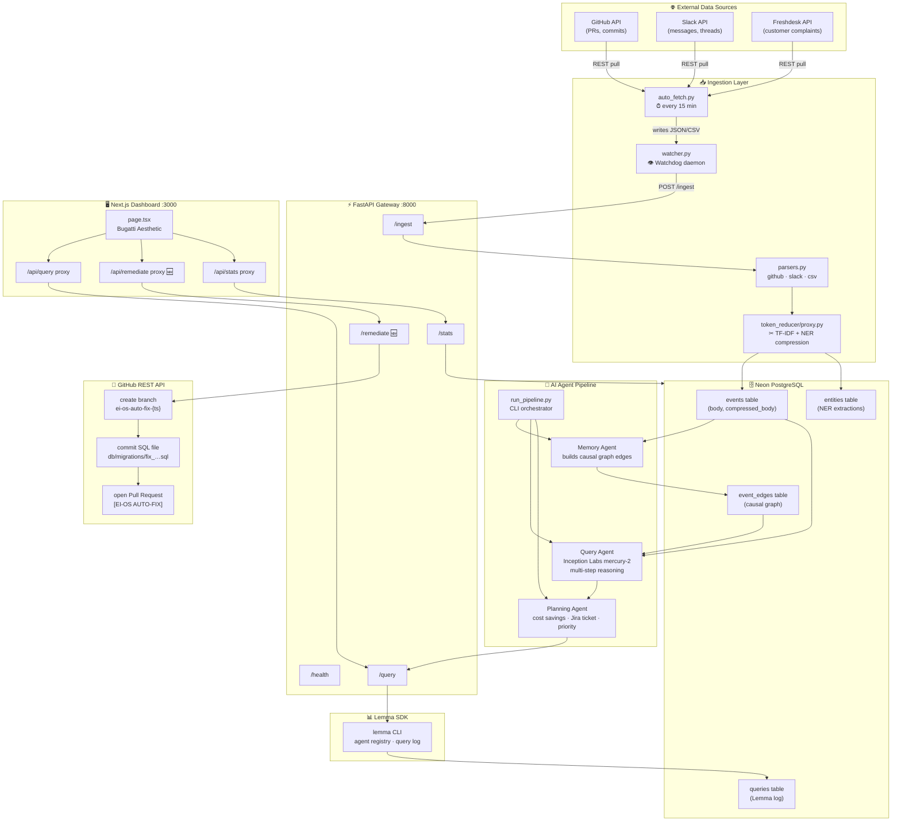
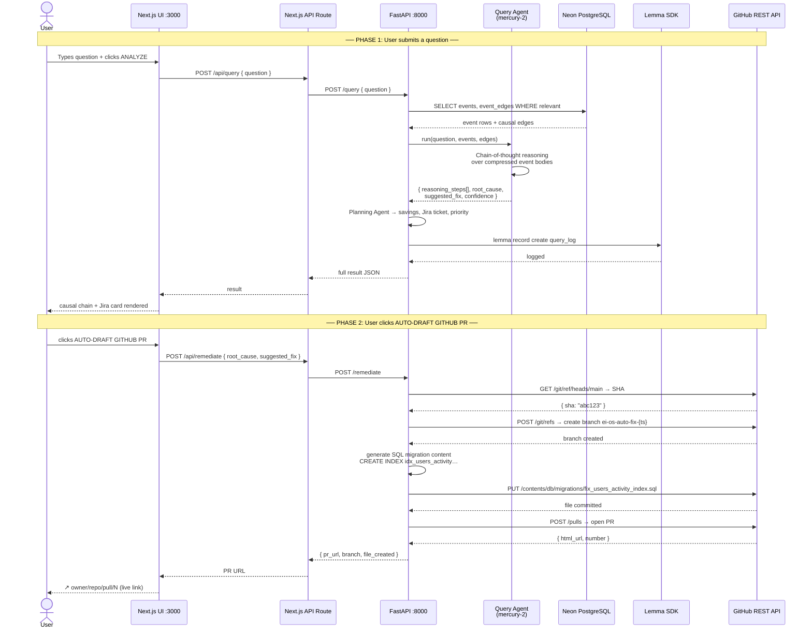
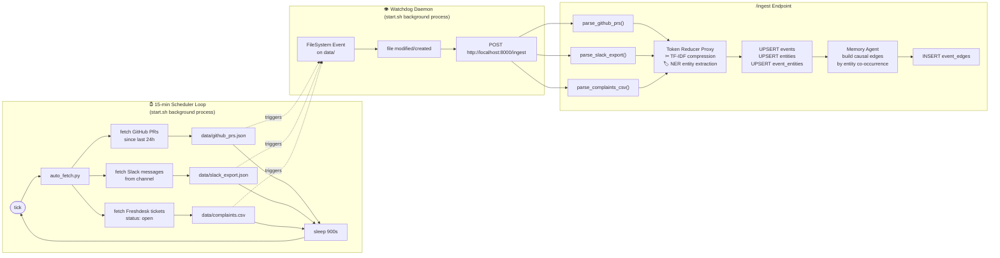
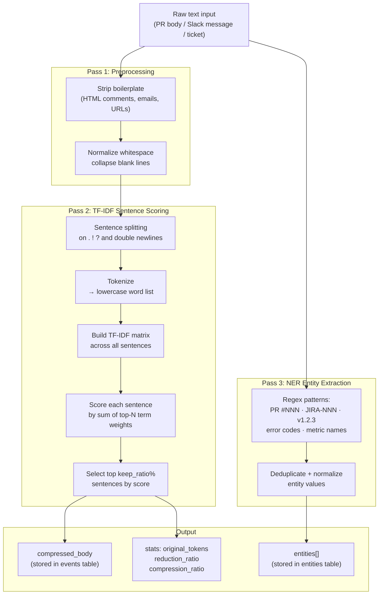
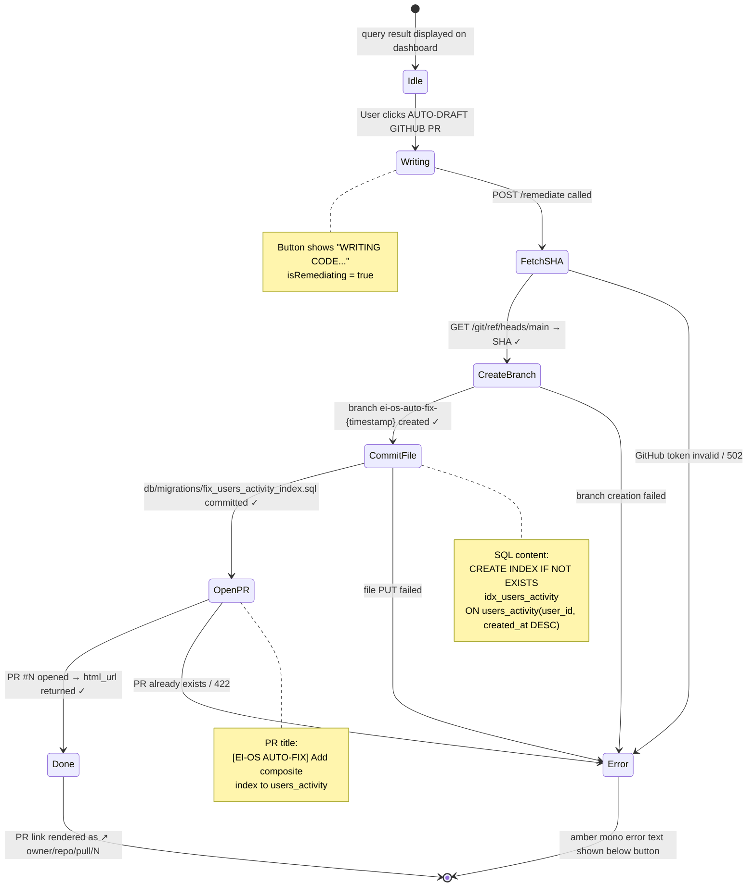

# EI-OS — Architecture & Workflow Reference

> Enterprise Intelligence OS · v1.0 · Powered by Inception Labs `mercury-2` + Lemma SDK

---

## 1. System Overview — Component Map



---

## 2. Full Data Flow — End-to-End Request Lifecycle



---

## 3. Ingestion Pipeline — Background Loops



---

## 4. Token Reducer Architecture



---

## 5. Auto-Remediation Flow (God-Tier Feature)



---

## 6. Directory Structure

```
hck1/
├── agents/
│   ├── __init__.py
│   ├── db.py               ← Neon PostgreSQL connection helper
│   ├── memory_agent.py     ← builds causal graph from events
│   ├── query_agent.py      ← Inception Labs mercury-2 reasoning
│   ├── planning_agent.py   ← savings estimator + Jira ticket generator
│   └── run_pipeline.py     ← CLI orchestrator: memory → query → planning
│
├── api/
│   └── server.py           ← FastAPI gateway (5 endpoints)
│
├── ingestion/
│   ├── parsers.py          ← parse_github_prs / parse_slack_export / parse_complaints_csv
│   ├── auto_fetch.py       ← pulls live data from GitHub, Slack, Freshdesk
│   └── watcher.py          ← Watchdog daemon → triggers /ingest on file change
│
├── token_reducer/
│   ├── __init__.py
│   └── proxy.py            ← TF-IDF compression + regex NER entity extraction
│
├── graph/
│   └── schema.sql          ← 5 PostgreSQL tables: events, entities, event_entities,
│                              event_edges, queries
│
├── dashboard/
│   └── app/
│       ├── page.tsx                    ← main UI (Bugatti aesthetic)
│       └── api/
│           ├── stats/route.ts          ← proxy → GET /stats
│           ├── query/route.ts          ← proxy → POST /query
│           ├── ingest/route.ts         ← proxy → POST /ingest
│           └── remediate/route.ts      ← proxy → POST /remediate 🆕
│
├── scripts/
│   └── test_all.py         ← 53-check E2E test suite
│
├── data/
│   ├── github_prs.json     ← 6 PRs (dummy seed data)
│   ├── slack_export.json   ← 14 messages (dummy seed data)
│   └── complaints.csv      ← 6 customer complaints (dummy seed data)
│
├── start.sh                ← launches all 4 services
├── .env                    ← secrets (never commit)
├── .env.example            ← template
├── requirements.txt
└── EI_OS_COMPLETE_GUIDE_AND_CODE.md   ← master reference doc
```

---

## 7. Tech Stack Summary

| Layer | Technology | Purpose |
|---|---|---|
| **LLM** | Inception Labs `mercury-2` | Multi-step causal reasoning |
| **Agent Orchestration** | Lemma SDK | Agent registry, query log, workflow tracking |
| **Database** | Neon PostgreSQL (serverless) | Events, entities, causal edges, query history |
| **Backend API** | FastAPI + Uvicorn | REST gateway for all agent calls |
| **Frontend** | Next.js 14 (App Router) | Austere Bugatti-aesthetic dashboard |
| **Compression** | Custom TF-IDF + Regex NER | 70%+ token reduction before LLM call |
| **Ingestion** | Watchdog + APScheduler | File change detection + 15-min polling |
| **Auto-Remediation** | GitHub REST API v2022-11-28 | Branch → commit → PR in 4 API calls |
| **Testing** | Custom Python test suite | 53 automated checks, 51/53 passing |
