# EI-OS — Architecture, Workflow & Project Documentation

This document outlines the architecture, data pipeline workflow, and accomplishments of the **Enterprise Intelligence OS (EI-OS)** project.

---

## 1. Project Overview & Capabilities
EI-OS is an autonomous diagnostics system designed to save engineering teams hours of manual troubleshooting. By connecting scattered events across GitHub, Slack, and Customer Complaints into a unified **Relational Knowledge Graph**, EI-OS can trace root causes and construct a step-by-step causal chain when queried about system anomalies.

### Key Capabilities Built & Optimized:
1. **Austere UI Redesign (Bugatti Aesthetic)**: Implemented a hyper-minimalist, monochromatic UI utilizing custom display, text serif, and monospace typography, complete with full-bleed styling, transparent pill shapes, and a 0px border-radius design scheme.
2. **Automated Live Data Fetcher**: Developed an automated scheduling service (`ingestion/auto_fetch.py`) that periodically polls the GitHub REST API, Slack Web API, and Freshdesk/Zendesk Ticket APIs to fetch live logs and updates.
3. **Watcher-Triggered Ingestion**: Configured a file watchdog system that detects new data dumps and triggers the ingestion pipeline automatically.
4. **Token Reducer Proxy**: Built a rule-and-heuristic-based data compression layer reducing raw JSON/CSV data size by ~70% before context-window injection to save costs and maximize processing speed.
5. **Batch Ingestion Performance**: Optimised PostgreSQL queries to use `execute_values` bulk inserts, mitigating API timeout errors and shortening ingestion time to under ~87 seconds for large event volumes.

---

## 2. System Architecture

The following diagram illustrates the architecture of EI-OS:

```mermaid
graph TD
    %% Sources
    subgraph Data Sources
        GH[GitHub API]
        SL[Slack API]
        FD_ZD[Freshdesk / Zendesk API]
    end

    %% Fetching & Watching
    subgraph Ingestion Daemon
        Scheduler[15-min Scheduler] -->|Triggers| Fetcher[Auto-Fetch Script]
        Fetcher -->|Writes to| DataFolder[(data/ directory)]
        Watchdog[Watchdog Service] -->|Monitors| DataFolder
    end

    %% API Server
    subgraph API Gateway (FastAPI)
        Watchdog -->|POST /ingest| IngestEP[Ingest Endpoint]
        IngestEP -->|Raw Data| Parsers[Data Parsers]
        Parsers -->|Text| TokenReducer[Token Reducer Proxy]
        TokenReducer -->|Compressed Content| DBInsert[Postgres Insert Loader]
    end

    %% Database
    subgraph Relational Graph (PostgreSQL)
        DBInsert -->|Bulk inserts| DB[(Neon PostgreSQL)]
        DB -->|Queries| DB
    end

    %% User Interaction
    subgraph Presentation & Query Layer
        UI[Next.js Dashboard] -->|User Input Query| QueryEP[POST /query]
        QueryEP -->|Graph Traversal| GraphSearch[Causal Path Finder]
        GraphSearch -->|Retrieve Events| DB
        GraphSearch -->|Synthesis Context| LLM[Anthropic Claude Agent]
        LLM -->|Synthesized Chain| UI
        UI -->|Fetch Stats| StatsEP[GET /stats]
        StatsEP -->|Read Aggregates| DB
    end
```

---

## 3. Core Data Workflow

```mermaid
sequenceDiagram
    autonumber
    actor User as Engineer
    participant UI as Next.js Dashboard
    participant Fetcher as Ingestion / Auto-Fetcher
    participant API as FastAPI Server
    participant TR as Token Reducer
    participant DB as Neon PostgreSQL

    %% Ingestion Workflow
    Note over Fetcher, DB: Ingestion Pipeline (Manual or Automated)
    rect rgb(20, 20, 20)
        Fetcher->>API: HTTP POST /ingest
        API->>TR: Compress documents (Clean noise, TF-IDF scoring, Entity extraction)
        TR-->>API: Compressed tokens (~70% reduction)
        API->>DB: Bulk insert records (psycopg2.extras.execute_values)
        API->>DB: Generate causal graph edges
        DB-->>API: Graph built successfully
        API-->>Fetcher: 200 OK (Ingest completed)
    end

    %% Query Workflow
    Note over User, DB: Causal Diagnosis Query Workflow
    rect rgb(20, 20, 20)
        User->>UI: Enter query: "Why did cloud costs spike?"
        UI->>API: HTTP POST /query { question }
        API->>DB: Query events & traverse causal relationship paths (CTE)
        DB-->>API: Relational path returned
        API->>API: Pass context to Reasoning Agent
        API-->>UI: Return synthesized root cause, fix suggestion, confidence & Jira ticket
        UI-->>User: Display step-by-step causal chain & copy-ready Jira ticket
    end
```



---

## 4. In-Depth Workflow Phases

### Phase A: Data Ingestion & Compression
1. **Fetch**: The `auto_fetch.py` script queries the external APIs (GitHub, Slack, Zendesk/Freshdesk).
2. **Watch**: Files are generated/overwritten in the `data/` folder. The `ingestion/watcher.py` daemon catches the file creation/modification event.
3. **Ingest Command**: The watcher hits the `/api/ingest` FastAPI endpoint.
4. **Token Reduction**: The text content is cleaned of markdown formatting, system tags, and emoji shortcodes. It calculates high-value semantic sentences and discards fluff.
5. **Bulk Insert**: The cleaned data is batched and loaded into Neon Postgres tables.

### Phase B: Query Processing & Reasoning Synthesis
1. **Search request**: The user submits a natural language question (e.g., "Why are database queries hanging?").
2. **Causal Graph Search**: The system executes a recursive Common Table Expression (CTE) query in Postgres, finding linked events across Slack threads (complaints), GitHub commits (PR merges), and customer complaints.
3. **LLM Synthesis**: The compiled, condensed causal context is processed by the Claude query and planning agents.
4. **Structured JSON Output**: The server responds with:
   - **Root Cause Summary**
   - **Suggested Fix**
   - **Reasoning Steps (Chain)** with source icons, logs, and findings
   - **Jira Ticket JSON** containing titles, labels, severity, and description formatting
   - **Savings metrics** and **Confidence scores**
